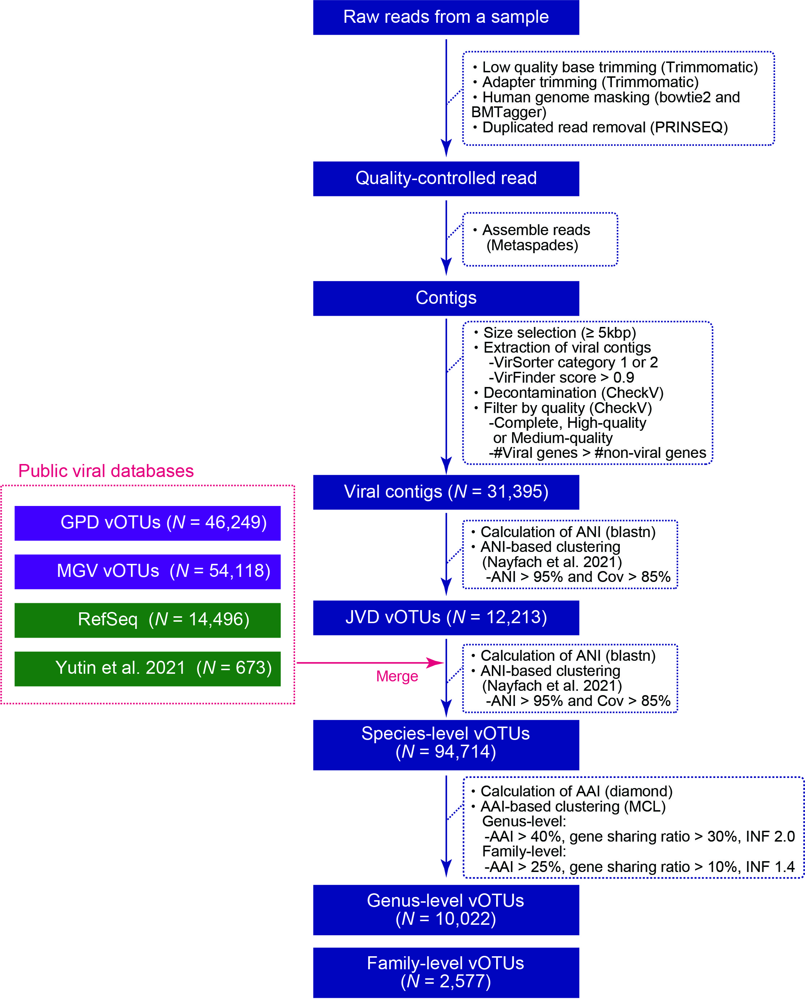

# JMAG_JVD
This is a repository for the codes used in the Tomofuji et al (prokaryotic and viral genomes recovered from 787 Japanese gut metagenomes revealed microbial features associated with diets, populations, and diseases).  
Our scripts recover   
・Metagenome assembled genomes (MAGs)  
・CRISPR spacers on the MAGs   
・Viral genomes  
from the metagenome shotgun sequencing data.  
Scripts related to the analysis performed in the Tomofuji et al are also deposited.  

## Requirements
・barrnap	(version 0.9, https://github.com/tseemann/barrnap)  
・bowtie2	(version 2.3.5.1, Langmead and Salzberg, 2012)  
・CheckM	(version 1.0.12, Parks et al., 2015)  
・CheckV	(software version 0.7.0, database version 1.0, Nayfach et al, 2021)  
・CONCOCT	(version 1.0.0, Alneberg et al. , 2014)  
・coverM	(version 0.6.1, Queensland University of Technology Microbiome Research Group)  
・DAS Tool	(version 1.1.2, Sieber et al., 2018)  
・DIAMOND	(version 2.0.4, Buchfink et al., 2021)  
・eggNOG-mapper	(version 2.1.2, Cantalapiedra et al. 2021)  
・hmmer	(version 3.1b2, Finn et al., 2011)  
・inStrain	(version 1.5.4, Olm et al., 2021)  
・MaxBin	(version 2.2.6, Wu et al., 2016)  
・MetaBAT	(version 2.12.1, Kang et al., 2019)  
・MinCED	(version 0.4.2, Bland et al., 2007)  
・MUMmer	(version 4.0.0.rc1, Marçais et al., 2018)  
・ncbi-blast-plus	(version 2.5.0, Camacho et al, 2009)  
・Prodigal	(version 2.6.3, Hyatt et al., 2010)  
・Prokka	(version 1.14.6, Seemann, 2014)  
・RefineM	(version 0.1.2, Parks et al., 2017)  
・Samtools	(version 1.10, Li et al., 2009)  
・Seqkit (version 0.12.1, Shen et al., 2016)    
・SPAdes	(version 3.13.0, Prjibelski et al., 2020)  
・tRNAScan-SE	(version 2.0.7, Chan et al., 2021)  
・VirFinder	(version 1.1, Ren et al., 2017)  
・VirSorter	(version 1.0.6, Roux et al., 2015)  

# Overview (Recovery of MAGs)

Scripts are deposited in `A_Binning`.

## Step1. Assembly
First, contigs were assembled from the gut metagenome shotgun sequencing data with the script `01_assembly_and_mapping_back.sh`.  
Input file should be named as `${ID}_R1.fastq.gz` and `${ID}_R2.fastq.gz`  
For the quality control of the metagenome shotgun sequencing reads, we used OMARU (https://github.com/toshi-kishikawa/OMARU).

Following variables are required:  
・`DIR`: Directory for analysis  
・`FASTQ_DIR`: Directory of original fastq file  
・`ID`: Sample ID   
・`THREADS`: Number of the threads  
・`LENGTH`: Minimum length of the contigs used for the subsequent analyses (2,000 bp was used in the original manuscript)  

This script performs de novo assembly by metaspades and mapping back of the seuqnecing reads to the assembled contigs by bowtie2.
Contigs and their coverages which were used for the subsequent binning were obtained in this step.

## Step2. Binning
Binning with metabat2, maxbin2, and concoct was performed with the script `02_binning_and_merge.sh`.   
The outputs from three softwares were combined with the dastools.

Following variables are required:  
・`DIR`: Directory for analysis  
・`ID`: Sample ID   
・`LENGTH`: Minimum length of the contigs used for the subsequent analyses (2,000 bp was used in the original manuscript)  

This script outputs raw bins which were subjected to the subsequent quality control.

## Step3. QC and refinement  
QC (CheckM) and refinement (RefineM) of the bins made in Step2 were performed with the script `03_QC_and_refine.sh`.  

Following variables are required:  
・`DIR`: Directory for analysis  
・`ID`: Sample ID   
・`SET_NAME`: Name of the dataset (used for the file name of the QCed MAGs) 

The protein and taxonomy databases for RefineM should be given with the variables `${REFINEM_PROTEIN_DB}` and `${REFINEM_TAXONOMY_DB}`, respectively.
This script outputs QCed MAGs (`${SET_NAME}_${ID}_dastool_{1-99}.fa`) and related statistics based on the CheckM.

## Step4. Analysis on the strain-level diversity, tRNA, and rRNA   
For the QCed MAGs recovered in the Step3, we calculated the strain-level diversity by inStrain (average nucleotide diversity).   
We also detected tRNA (tRNAscan-SE) and rRNA (barrnap) in the QCed MAGs.  
These analyses were performed with the script `04_strain_div_and_RNA_anno.sh`.  

Following variables are required:  
・`DIR`: Directory for analysis  
・`ID`: Sample ID   
・`FASTQ_DIR`: Directory of original fastq file  

This script outputs a single summary file which includes the summarized results of the inStrain, tRNAscan-SE, and barrnap.

## Step5. Prediction and annotation of the genes on the MAGs   
For the QCed MAGs recovered in the Step3, we predicted the genes with the prodigal.   
Then, functions of these putative genes were annotated with the eggNOG-mapper.  
These analyses were performed with the script `05_Gene_annotation.sh`.  

Following variables are required:  
・`DIR`: Directory for analysis  
・`ID`: Sample ID   
・`THREADS`: Number of the threads  
・`EGG_NOG_DB_DIR`: Directory of the databases for the eggNOG-mapper  

This script outputs the result of the prodigal and eggNOG-mapper per MAGs.
Per-sample summary files for the each annoytation of the eggNOG-mapper (i.e. COG, KEGG gene, KEGG pathway, KEGG module, and CAZy) are also generated.

## Step6. Finding the CRISPR sequences in the MAGs and blast search against the viral sequences
For the QCed MAGs recovered in the Step3, we predicted the CRISPR sequences with the MINCED (`06_1_CRISPR_FIND.sh`).   

Following variables are required:  
・`DIR`: Directory for analysis  
・`ID`: Sample ID   

`06_1_CRISPR_FIND.sh` outputs the spacer sequences per MAGs.

Then, CRISPR spacers were subjected to the blast search against the viral genome databases with the script `06_2_CRISPR_BLAST.sh`.

Following variables are required:  
・`DIR`: Directory for analysis  
・`ID`: Sample ID   
・`DB`: A blast database made from a viral genome database   
・`DB_NAME`: Name of the viral genome database (used for the name of the directory of the result files [`${DIR}/BIN_CRISPR/${ID}/BLAST/${DB_NAME}_${SOFT}`])  

This script outputs the results of the blast search.

# Overview (Recovery of the viral genomes)

Scripts are deposited in `B_Viral_genome_recovery`.

## StepV1. VirSorter and VirFinder
Viral genomes were detected by the VirSorter and VirFinder from the contigs assembled in the Step1.   
This procedure was performed with the sceript `V01_VirSorter_and_VirFinder.sh`.

Following variables are required:  
・`DIR`: Directory for analysis  
・`ID`: Sample ID   
・`LENGTH`: Minimum length of the contigs used for the subsequent analyses (5,000 bp was used in the original manuscript)  
・`VIR_FINDER_DIR`: A directory which contains the VirFinder software (virfinder.R).  
・`VIR_SORTER_DB_DIR`: A directory which contains the databases for the VirFinder.  
・`SCRIPT_DIR`: A directory which contains the custom scripts used in the `V01_VirSorter_and_VirFinder.sh` (i.e. Virome_sorter_finder_merge.R).  

The results of the VirSorter and VirFinder are summarized into the `${ID}_virsorter_and_finder.txt`.

## StepV2. Extraction of the viral contigs and quality control by the CheckV
Viral genomes were extracted based on the result in the StepV1 and subjected to the quality control by the CheckV software.
This procedure was performed with the sceript `V02_contig_extraction_and_CheckV.sh`.

Following variables are required:  
・`DIR`: Directory for analysis  
・`ID`: Sample ID   
・`SET_ID`: Name of the dataset which is used for the name of the output files  
・`SCRIPT_DIR`: A directory which contains the custom scripts used in the `V02_contig_extraction_and_CheckV.sh` (i.e. Virome_ver2_metrics_summary.R and Virome_rename_ver2.py).  
・`CHECKV_DB`: A path to the database for the CheckV.  

The QCed viral genome sequences are sumamrized in the `${DIR}/VIRUS_2/${ID}/Renamed_virus.fa.gz`.

## StepV3. Prophage analysis with the recovered viral genomes
Prophage analysis was performed based on the MAGs and viral genomes recovered from the same samples.
This procedure was performed with the sceript `V03_PROPHAGE_FIND.sh`.

Following variables are required:  
・`DIR`: Directory for analysis  
・`ID`: Sample ID   

The result of the analysis is written in the `${ID}_Prophage_summary.tsv`.

## StepV4. Quantification of the viruses
Mapping-based quantification of the viruses was performed with the script `V04_virus_quantification.sh`.

Following variables are required:  
・`DIR`: Directory for analysis  
・`ID`: Sample ID   
・`FASTQ_DIR`: Directory of original fastq file  
・`NUM`: Number of the reads used for the quantification   
・`BT2_DB`: Bowtie2 index made from the viral genomes  

The result of the analysis is written in the `${ID}_${DATABASE}_coverM.tsv.gz`.

## StepV5. Prediction and annotation of the genes on the viral genomes   
*** This part is run after combining the viral genome sequences into a single fasta file ***   
For the QCed viral genomes recovered in Step2, we predicted the genes with the prodigal.   
Then, functions of these putative genes were annotated with the eggNOG-mapper and hmm-search against the VOG database.  
These analyses were performed with the script `V05_protein_annotation.sh`.  

Following variables are required:  
・`DIR`: Directory for analysis  
・`THREADS`: Number of the threads  
・`BATCH_FILE_DIR`: Directiry which contains text files `Virus_batch_${SGE_TASK_ID}.tsv`  
・`EGG_NOG_DB_DIR`: Directory of the databases for the eggNOG-mapper  
・`VOG_HMM_DIR`: Directory of the hmm profiles of the VOG database  
・`SCRIPT_DIR`: A directory which contains the custom scripts used in the `V05_protein_annotation.sh` (i.e. RCODE_VOG_processing.r)  
・`SGE_TASK_ID`: Batch number (1-)  

We performed this analysis per batches.   
The viral genomes processed in each batch is defined in the `Virus_batch_${SGE_TASK_ID}.tsv`.   
`Virus_batch_${SGE_TASK_ID}.tsv` is a single column text file containing the names of the viral genomes (without header).

## Other related codes    
Other related codes are deposited in `C_Other_related_codes`

## How to download the JMAG, JVD, and CRISPR spacers
JMAG, JVD, and CRISPR spacers were deposited in DNA Data Bank of Japan (DDBJ) and their urls were summarized in the National Bioscience Database Center (NBDC) with the accession number of hum0197.   
You can also directly download these sequences from the ftp server of the DDBJ with the wget command.  
We provided the urls for all the files in the `URL_list` folder.  

## Contact
Yoshihiko Tomofuji: ytomofuji_at_sg.med.osaka-u.ac.jp
